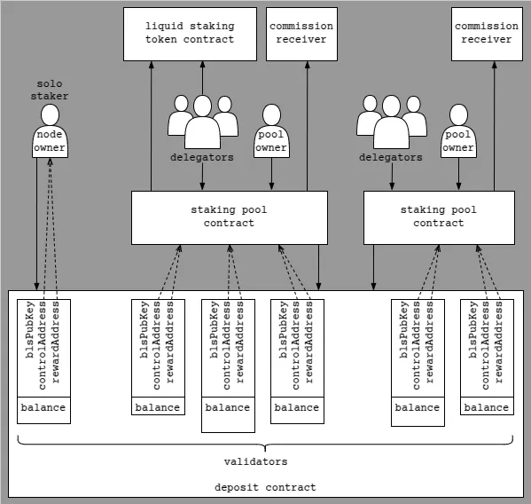

# Delegated Staking

Validators of the Zilliqa 2.0 network are solo stakers by default. This repository contains the contracts and scripts needed to create a staking pool operating one or more validator nodes that users can delegate to. Currently, the contracts exist in two variants:
1. When delegating stake to the **liquid variant**, users receive a non-rebasing liquid staking token (LST) that anyone can send to the pool's contract to withdraw the stake plus the corresponding share of the staking rewards.
1. When delegating stake to the **non-liquid variant**, users become eligible to claim their share of the staking rewards without withdrawing their stake.

<p align="center">
    
</p>


## Prerequisites

To deploy and interact with the contracts throught the CLI, use the Forge scripts provided in this repository and described further below. First, install Foundry (https://book.getfoundry.sh/getting-started/installation) and the OpenZeppelin contracts before proceeding with the deployment:
```
forge install OpenZeppelin/openzeppelin-contracts-upgradeable --no-commit
forge install OpenZeppelin/openzeppelin-contracts --no-commit
```

Set the `FOUNDRY_ETH_RPC_URL` environment variable to point to your RPC node:
```bash
export FOUNDRY_ETH_RPC_URL=http://localhost:4202
```

Alternatively, you can specify the RPC in each command below by adding the following option
```bash
--rpc-url http://localhost:4202
```

Specify the local folder containing the Solidity contracts of the Zilliqa 2.0 repository in `remappings.txt`:
```
@zilliqa/zq2/=/home/user/zq2/zilliqa/src/contracts/
```

## Contract Deployment

The delegation contract manages the stake delegated to the staking pool. It acts as the validator node's control address and interacts with the Zilliqa 2.0 protocol's deposit contract.

`BaseDelegation` is an abstract contract that concrete implementations inherit from.
`LiquidDelegation` implements the liquid staking variant, which deploys a `NonRebasingLST` contract when it is initialized. `NonLiquidDelegation` implements the non-liquid staking variant, which allows delegators to withdraw rewards.

Before running the deployment script, set the `PRIVATE_KEY` environment variable to the private key of the contract owner. Note that only the contract owner will be able to upgrade the contract, change the commission rate and activate the node as a validator.

To deploy `LiquidDelegation` run
```bash
forge script script/Deploy.s.sol --broadcast --legacy --sig "liquidDelegation(string,string)" Name Symbol
```
using the `Name` and the `Symbol` of your LST.

To deploy `NonLiquidDelegation` run
```bash
forge script script/Deploy.s.sol --broadcast --legacy --sig "nonLiquidDelegation()"
```

You will see an output like this:
```
  Signer is 0x15fc323DFE5D5DCfbeEdc25CEcbf57f676634d77
  Proxy deployed: 0x7A0b7e6D24eDe78260c9ddBD98e828B0e11A8EA2 
  Implementation deployed: 0x7C623e01c5ce2e313C223ef2aEc1Ae5C6d12D9DD
  Owner is 0x15fc323DFE5D5DCfbeEdc25CEcbf57f676634d77
  Upgraded to version: 0.9.0
```

You will need the proxy address from the above output in all commands below. If you know the address of a proxy contract but don't know which variant of staking it supports, run
```bash
forge script script/CheckVariant.s.sol --sig "run(address payable)" 0x7A0b7e6D24eDe78260c9ddBD98e828B0e11A8EA2
```
The output will be `LiquidStaking`, `NonLiquidStaking` or none of them if the address is not a valid delegation contract.

You can upgrade the contract to the latest version by running
```bash
forge script script/Upgrade.s.sol --broadcast --legacy --sig "run(address payable)" 0x7A0b7e6D24eDe78260c9ddBD98e828B0e11A8EA2
```

The output will look like this:
```
  Signer is 0x15fc323DFE5D5DCfbeEdc25CEcbf57f676634d77
  Upgrading from version: 0.8.3
  Owner is 0x15fc323DFE5D5DCfbeEdc25CEcbf57f676634d77
  New implementation deployed: 0x64Fa96a67910956141cc481a43f242C045c10165
  Upgraded to version: 0.9.0
```

If you want to check the current version your contract was upgraded to, run
```bash
forge script script/CheckVersion.s.sol --sig "run(address payable)" 0x7A0b7e6D24eDe78260c9ddBD98e828B0e11A8EA2
```

Depending on which variant you deployed, you can verify your contract on Sourcify by running 
```bash
forge verify-contract 0x7C623e01c5ce2e313C223ef2aEc1Ae5C6d12D9DD LiquidDelegation --verifier sourcify
```
or
```bash
forge verify-contract 0x7C623e01c5ce2e313C223ef2aEc1Ae5C6d12D9DD NonLiquidDelegation --verifier sourcify
```
using the address of the implementation. Note that you have to repeat this with the address of the new implementation each time you upgrade your delegation contract. You have to verify the proxy contract separately and only once after the initial deployment by running
```bash
forge verify-contract 0x7A0b7e6D24eDe78260c9ddBD98e828B0e11A8EA2 ERC1967Proxy --verifier sourcify --constructor-args $(cast abi-encode "_(address,bytes)" 0x7C623e01c5ce2e313C223ef2aEc1Ae5C6d12D9DD $(cast calldata "initialize(address,string,string)" 0x15fc323DFE5D5DCfbeEdc25CEcbf57f676634d77 Name Symbol))
```
using the address of the proxy contract, the address of the implementation contract and the signer address of the deployment transaction as well as the token `Name` and `Symbol` that you specified during deployment, or
```bash
forge verify-contract 0x7A0b7e6D24eDe78260c9ddBD98e828B0e11A8EA2 ERC1967Proxy --verifier sourcify --constructor-args $(cast abi-encode "_(address,bytes)" 0x7C623e01c5ce2e313C223ef2aEc1Ae5C6d12D9DD $(cast calldata "initialize(address)" 0x15fc323DFE5D5DCfbeEdc25CEcbf57f676634d77))
```
using the address of the proxy contract, the address of the implementation contract and the signer address of the deployment transaction.


## Contract Configuration

Now you can set the commission on the rewards the staking pool's validators earn to e.g. 10% as follows:
```bash
forge script script/Configure.s.sol --broadcast --legacy --sig "commissionRate(address payable, uint16)" 0x7A0b7e6D24eDe78260c9ddBD98e828B0e11A8EA2 1000
```

The output will contain the following information:
```
  Running version: 0.9.0
  Commission rate: 0.0%
  New commission rate: 10.0%
```

Note that if the pool holds delegated stake, you can only change the commission rate by less than 2 percentage points at once and the last change must be at least `86400` blocks old.

To view the block height of the last change to the commission rate, run
```bash
forge script script/Configure.s.sol --broadcast --legacy --sig "commissionChange(address payable)" 0x7A0b7e6D24eDe78260c9ddBD98e828B0e11A8EA2
```

To view the current commission rate, run
```bash
forge script script/Configure.s.sol --broadcast --legacy --sig "commissionRate(address payable)" 0x7A0b7e6D24eDe78260c9ddBD98e828B0e11A8EA2
```

Note that the commission rate is specified as an integer to be divided by the `DENOMINATOR` which can be retrieved from the delegation contract:
```bash
cast call 0x7A0b7e6D24eDe78260c9ddBD98e828B0e11A8EA2 "DENOMINATOR()(uint256)"  | sed 's/\[[^]]*\]//g'
```

Once the validator is activated and starts earning rewards, the commission is deducted and transferred automatically each time delegators stake or unstake or the rewards accrued in the contract balance are staked. The contract owner can request the outstanding commission that hasn't been transferred yet by running:
```bash
forge script script/CollectCommission.s.sol --broadcast --legacy --sig "run(address payable)" 0x7A0b7e6D24eDe78260c9ddBD98e828B0e11A8EA2
```

By default, the commission is transferred to the original contract owner. The current contract owner can change the commission receiver by running the following command with a non-zero address as the second argument:
```bash
forge script script/Configure.s.sol --broadcast --legacy --sig "commissionReceiver(address payable, address)" 0x7A0b7e6D24eDe78260c9ddBD98e828B0e11A8EA2 0xeA78aAE5Be606D2D152F00760662ac321aB8F017
```

The output will contain the following information:
```
  Running version: 0.9.0
  Commission receiver: 0x15fc323DFE5D5DCfbeEdc25CEcbf57f676634d77
  New commission receiver: 0xeA78aAE5Be606D2D152F00760662ac321aB8F017
```

Using the above command the commission can be redirected to a cold wallet, a multisig wallet or a smart contract which splits the commission proportionally to the deposit of the validators who join the staking pool.

To view the current commission receiver, run
```bash
forge script script/Configure.s.sol --broadcast --legacy --sig "commissionReceiver(address payable)" 0x7A0b7e6D24eDe78260c9ddBD98e828B0e11A8EA2
```


## Validator Addition and Removal

A staking pool can operate with up to 255 validator nodes.

If your node has already been activated as a validator i.e. solo staker, it can join a staking pool. Run
```bash
cast send --legacy --private-key 0x... \
0x7A0b7e6D24eDe78260c9ddBD98e828B0e11A8EA2 "registerControlAddress(bytes)" \
0x92fbe50544dce63cfdcc88301d7412f0edea024c91ae5d6a04c7cd3819edfc1b9d75d9121080af12e00f054d221f876c
```
using the private key of your node's control address that you used to deposit the stake of your validator or its current control address in case you changed it later, and your node's BLS public key, followed by 
```bash
cast send --legacy --private-key 0x... \
0x00000000005a494c4445504f53495450524f5859 "setControlAddress(bytes,address)" \
0x92fbe50544dce63cfdcc88301d7412f0edea024c91ae5d6a04c7cd3819edfc1b9d75d9121080af12e00f054d221f876c \
0x7A0b7e6D24eDe78260c9ddBD98e828B0e11A8EA2
```
using the same private key, BLS public key and the address of the staking pool's delegation contract. Afterwards, the staking pool contract owner must run
```bash
cast send --legacy --private-key $PRIVATE_KEY \
0x7a0b7e6d24ede78260c9ddbd98e828b0e11a8ea2 "joinPool(bytes)" \
0x92fbe50544dce63cfdcc88301d7412f0edea024c91ae5d6a04c7cd3819edfc1b9d75d9121080af12e00f054d221f876c
```
using your node's BLS public key to add your node to the pool. If you decide to cancel the handover before the pool owner runs the above command, run
```bash
cast send --legacy --private-key 0x... \
0x7A0b7e6D24eDe78260c9ddBD98e828B0e11A8EA2 "unregisterControlAddress(bytes)" \
0x92fbe50544dce63cfdcc88301d7412f0edea024c91ae5d6a04c7cd3819edfc1b9d75d9121080af12e00f054d221f876c
```
using the same private key and BLS public key as above.

To leave a staking pool, run 
```bash
cast send --legacy --private-key 0x... \
0x7a0b7e6d24ede78260c9ddbd98e828b0e11a8ea2 "leavePool(bytes)" \
0x92fbe50544dce63cfdcc88301d7412f0edea024c91ae5d6a04c7cd3819edfc1b9d75d9121080af12e00f054d221f876c
```
using the private key of your node's control address, your node's BLS public key and the address of the staking pool's delegation contract. Note that your validator can't leave the staking pool as long as there are pending stake withdrawals from its deposit. The following event emitted by the above transaction indicates whether the request was successful or not:
```solidity
event ValidatorLeaving(bytes indexed blsPubKey, bool success);
```

If it wasn't, use the following command to check if the validator has pending withdrawals and repeat the above command when the query returns `false`:
```bash
cast call 0x7a0b7e6d24ede78260c9ddbd98e828b0e11a8ea2 "pendingWithdrawals(bytes)(bool)" \
0x92fbe50544dce63cfdcc88301d7412f0edea024c91ae5d6a04c7cd3819edfc1b9d75d9121080af12e00f054d221f876c
```

If your validator's deposit was lower than the value of your LST balance or staked ZIL then you can claim the difference after the unbonding period as explained in the section about unstaking. If your validator's deposit was higher, then it can't leave the staking pool yet. First, its deposit is automatically reduced to the value of your LST balance or staked ZIL and the difference is redistributed among the validators remaining in the staking pool after the unbonding period.

To complete the leaving of your validator, run the following command as soon as the unbonding period is over:
```bash
cast send --legacy --private-key 0x... \
0x7a0b7e6d24ede78260c9ddbd98e828b0e11a8ea2 "completeLeaving(bytes)" \
0x92fbe50544dce63cfdcc88301d7412f0edea024c91ae5d6a04c7cd3819edfc1b9d75d9121080af12e00f054d221f876c
```
After leaving the staking pool, your node will remain a validator.

If you don't have an activated validator node yet, but have already deployed a delegation contract and your balance as the contract owner covers the required minimum stake, you can turn a fully synced node into the first validator in your staking pool by submitting a transaction with e.g. 10 million ZIL through
```bash
cast send --legacy --value 10000000ether --private-key $PRIVATE_KEY \
0x7a0b7e6d24ede78260c9ddbd98e828b0e11a8ea2 "depositFromPool(bytes,bytes,bytes)" \
0x92fbe50544dce63cfdcc88301d7412f0edea024c91ae5d6a04c7cd3819edfc1b9d75d9121080af12e00f054d221f876c \
0x002408011220d5ed74b09dcbe84d3b32a56c01ab721cf82809848b6604535212a219d35c412f \
0xb14832a866a49ddf8a3104f8ee379d29c136f29aeb8fccec9d7fb17180b99e8ed29bee2ada5ce390cb704bc6fd7f5ce814f914498376c4b8bc14841a57ae22279769ec8614e2673ba7f36edc5a4bf5733aa9d70af626279ee2b2cde939b4bd8a
```
with the BLS public key, the peer id and the BLS signature of the node. Note that you must provide the delegation contract address as `control_address` when creating the BLS public key and signature:
```bash
echo '{"secret_key":"...", "chain_id":..., "control_address":"0x7a0b7e6d24ede78260c9ddbd98e828b0e11a8ea2"}' | cargo run --bin convert-key
```
and covert the `peer_id` generated by the `convert-key` utility from base58 to hex encoding required by `depositFromPool(bytes,bytes,bytes)`above.

Even if you don't own the required minimum stake to deposit a validator, your delegation contract can start collecting delegated stake and as soon as its funds plus your balance cover the required minimum stake, you can activate a fully synced node as your first validator by providing e.g. 5 million ZIL in addition to your delegation contract's funds in the command introduced above:
```bash
cast send --legacy --value 5000000ether --private-key $PRIVATE_KEY \
0x7a0b7e6d24ede78260c9ddbd98e828b0e11a8ea2 "depositFromPool(bytes,bytes,bytes)" \
0x92fbe50544dce63cfdcc88301d7412f0edea024c91ae5d6a04c7cd3819edfc1b9d75d9121080af12e00f054d221f876c \
0x002408011220d5ed74b09dcbe84d3b32a56c01ab721cf82809848b6604535212a219d35c412f \
0xb14832a866a49ddf8a3104f8ee379d29c136f29aeb8fccec9d7fb17180b99e8ed29bee2ada5ce390cb704bc6fd7f5ce814f914498376c4b8bc14841a57ae22279769ec8614e2673ba7f36edc5a4bf5733aa9d70af626279ee2b2cde939b4bd8a
```

Note that the reward address registered for the validator node will be the address of the delegation contract (the proxy contract to be more precise), but the deposit will not take effect and the node will not start to earn rewards until the epoch after next.


## Staking and Unstaking

Once the delegation contract has been deployed and upgraded to the latest version, it can accept delegations. In order to stake e.g. 200 ZIL, run
```bash
forge script script/Stake.s.sol --broadcast --legacy --sig "run(address payable, uint256)" 0x7A0b7e6D24eDe78260c9ddBD98e828B0e11A8EA2 200000000000000000000 --private-key 0x...
```
with the private key of delegator account. It's important to make sure the account's balance can cover the transaction fees plus the 200 ZIL to be delegated.

The output will look like this for liquid staking:
```
  Running version: 0.9.0
  Current stake: 10000000000000000000000000 wei
  Current rewards: 110314207650273223687 wei
  LST address: 0x9e5c257D1c6dF74EaA54e58CdccaCb924669dc83
  Staker balance before: 99899145245801454561224 wei 0 LST
  Staker balance after: 99699145245801454561224 wei 199993793908430833324 LST
```
and like this for the non-liquid variant:
```
  Running version: 0.9.0
  Current stake: 10000000000000000000000000 wei
  Current rewards: 110314207650273223687 wei
  Staker balance before: 99899145245801454561224 wei
  Staker balance after: 99699145245801454561224 wei
```

Due to the fact that the above output was generated based on the local script execution before the transaction got submitted to the network, the ZIL balance does not reflect the gas fees of the staking transaction and the LST balance is also different from the actual LST balance which you can query by running
```bash
cast call $(cast call 0x7A0b7e6D24eDe78260c9ddBD98e828B0e11A8EA2 "getLST()(address)") "balanceOf(address)(uint256)" 0xd819fFcE7A58b1E835c25617Db7b46a00888B013 | sed 's/\[[^]]*\]//g'
```

Copy the LST address from the above output and add it to your wallet if you want to transfer liquid staking tokens to another account.

To query the current price of an LST, run
```bash
cast to-unit $(cast call 0x7A0b7e6D24eDe78260c9ddBD98e828B0e11A8EA2 "getPrice()(uint256)" --block latest | sed 's/\[[^]]*\]//g') ether
```

To unstake e.g. 100 LST (liquid variant) or 100 ZIL (non-liquid variant), run
```bash
forge script script/Unstake.s.sol --broadcast --legacy --sig "run(address payable, uint256)" 0x7A0b7e6D24eDe78260c9ddBD98e828B0e11A8EA2 100000000000000000000 --private-key 0x...
```
using the private key of an account that holds some LST in case of the liquid variant or using the private key of the delegator account in case of the non-liquid variant.

The output will look like this for liquid staking:
```
  Running version: 0.9.0
  Current stake: 10000000000000000000000000 wei
  Current rewards: 331912568306010928520 wei
  LST address: 0x9e5c257D1c6dF74EaA54e58CdccaCb924669dc83
  Staker balance before: 99698814298179759361224 wei 199993784619390291653 LST
  Staker balance after: 99698814298179759361224 wei 99993784619390291653 LST
```
and like this for the non-liquid variant:
```
  Running version: 0.9.0
  Current stake: 10000000000000000000000000 wei
  Current rewards: 331912568306010928520 wei
  Staker balance before: 99698814298179759361224 wei
  Staker balance after: 99698814298179759361224 wei
```

The ZIL balance hasn't increased yet because the unstaked amount can not be transferred immediately. To claim the unstaked amount after the unbonding period, run
```bash
forge script script/Claim.s.sol --broadcast --legacy --sig "run(address payable)" 0x7A0b7e6D24eDe78260c9ddBD98e828B0e11A8EA2 --private-key 0x...
```
with the private key of the account that unstaked in the previous step.

The output will look like this:
```
  Running version: 0.9.0
  Staker balance before: 99698086421983460161224 wei
  Staker balance after: 99798095485861371162343 wei
```

To query how much ZIL you can already claim, run
```bash
cast to-unit $(cast call 0x7A0b7e6D24eDe78260c9ddBD98e828B0e11A8EA2 "getClaimable()(uint256)" --from 0xd819fFcE7A58b1E835c25617Db7b46a00888B013 --block latest | sed 's/\[[^]]*\]//g') ether
```
with the address of the account that unstaked above as an argument.

Note that if a delegation contract represents a staking pool with multiple validators, each staking and unstaking will increase and decrease all validators' deposit proportionally to their current deposit. In case the surplus of the deposits exceeding the required minimum is insufficient to match an unstaking request, one or more validators will be removed entirely from both the deposit contract and the staking pool. The required fraction of the removed validators' withdrawn deposits will be reserved for claims and the rest will be distributed among the remaining validators to increase their deposits.

Of course, delegators will not be using the CLI to stake, unstake and claim their funds. To enable delegators to access your staking pool through the staking portal maintained by the Zilliqa team, get in touch and provide your delegation contract address once you have set up the validator node and delegation contract. If you want to integrate staking into your dapp, see the [Development and Testing](#development-and-testing) section below.


## Withdrawing or Staking Rewards

In the liquid staking variant, you as the node operator can stake the rewards accrued by the node. To do so, run
```bash
forge script script/StakeRewards.s.sol --broadcast --legacy --sig "run(address payable)" 0x7A0b7e6D24eDe78260c9ddBD98e828B0e11A8EA2 --private-key 0x...
```

In the non-liquid variant of staking, delegators can stake or withdraw their share of the rewards. To query the amount of rewards available, run
```bash
cast to-unit $(cast call 0x7A0b7e6D24eDe78260c9ddBD98e828B0e11A8EA2 "rewards()(uint256)" --from 0xd819fFcE7A58b1E835c25617Db7b46a00888B013 --block latest | sed 's/\[[^]]*\]//g') ether
```

If a user hasn't withdrawn rewards while thousands of delegators staked or unstaked, the gas used by the above function might hit the block limit. In this case it's also possible to withdraw only the rewards accrued during the next `n` staking periods recorded in the staking history that have not been withdrawn yet. Note that every time a delegator stakes or unstakes, a new staking period is appended to the staking history. Reward withdrawals from `n` staking periods can be repeated to withdraw all rewards through multiple transactions. To calculate the rewards that can be withdrawn in the next transaction using e.g. `n = 100` run
```bash
cast to-unit $(cast call 0x7A0b7e6D24eDe78260c9ddBD98e828B0e11A8EA2 "rewards(uint64)(uint256)" 100 --from 0xd819fFcE7A58b1E835c25617Db7b46a00888B013 --block latest | sed 's/\[[^]]*\]//g') ether
```
Note that `n` is actually the number of additional stakings periods so that at least one period is always reflected in the result, even if you specify `n = 0`. To estimate the upper bound on `n` that would be sufficient to withdraw all rewards of delegator `0xd819fFcE7A58b1E835c25617Db7b46a00888B013`, run
```bash
cast call 0x7A0b7e6D24eDe78260c9ddBD98e828B0e11A8EA2 "getAdditionalSteps()(uint64)" --from 0xd819fFcE7A58b1E835c25617Db7b46a00888B013
```

If the result is less than `10000` then it is safe to withdraw all rewards at once, otherwise you can simulate the withdrawal transaction without submitting it by running
```bash
cast estimate 0x7A0b7e6D24eDe78260c9ddBD98e828B0e11A8EA2 "withdrawlAllRewards()" --from 0xd819fFcE7A58b1E835c25617Db7b46a00888B013 --gas-limit 84000000
```
If the estimation fails due to the gas exceeding the block limit, divide `n` between several partial withdrawal transactions. Note that even if `n` appears to be very high, it's still worth doing the gas estimation, as the reward calculation will skip the staking periods included in `n` during which the delegator had zero stake. 

You can also specify the exact amount you want to withdraw. To withdraw e.g. 1000 ZIL using `n = 100`, run
```bash
forge script script/WithdrawRewards.s.sol --broadcast --legacy --sig "run(address payable, string, string)" 0x7A0b7e6D24eDe78260c9ddBD98e828B0e11A8EA2 1000000000000000000000 100 --private-key 0x...
```
with the private key of a delegator account. To withdraw as much as possible using a specified `n` set the amount to `all`. To withdraw the specified amount without specifying `n` replace `n` with `all`. To withdraw all rewards replace both the amount and `n` with `all`.

Last but not least, in order to stake rewards instead of withdrawing them, run
```bash
forge script script/StakeRewards.s.sol --broadcast --legacy --sig "run(address payable)" 0x7A0b7e6D24eDe78260c9ddBD98e828B0e11A8EA2 --private-key 0x...
```
using the private key of the delegator account.


## Replacing the Delegator Address

Delegators of non-liquid staking pools can replace their address in 2 steps. First, use the private key of your current address to set the new address `0x092E5E57955437876dA9Df998C96e2BE19341670` by running
```bash
cast send --legacy --private-key 0x... 0x7a0b7e6d24ede78260c9ddbd98e828b0e11a8ea2 "setNewAddress(address)" 0x092E5E57955437876dA9Df998C96e2BE19341670
```

Second, use the private key of the new address to replace the old address `0xd819fFcE7A58b1E835c25617Db7b46a00888B013` by running
```bash
cast send --legacy --private-key 0x... 0x7a0b7e6d24ede78260c9ddbd98e828b0e11a8ea2 "replaceOldAddress(address)" 0xd819fFcE7A58b1E835c25617Db7b46a00888B013
```


## Development and Testing

Staking pool operators are encouraged to fork and adapt the above contracts to implement features such as instant unstaking for a premium fee, automated staking of rewards to achieve the best possible APR or issuing a rebasing liquid staking token with a constant price of 1 ZIL and holder balances adjusted according to the rewards accrued.

The tests included in this repository should also be adjusted and extended accordingly. They can be executed by running
```bash
unset FOUNDRY_ETH_RPC_URL
forge test
```
or
```bash
unset FOUNDRY_ETH_RPC_URL
forge test -vv
```
if you want to see the values calculated in the tests.

To execute end-to-end tests on a local network, open `config_docker.toml` and change
* the funds of the first item in `nodes.consensus.genesis_accounts` to `5000000000000000000000000`
* the `withdrawal_period` in `nodes.consensus.contract_upgrades` to `5`
* the `nodes.consensus.blocks_per_epoch` to `3`

and run
```bash
chmod +x e2e_liquid.sh && ./e2e_liquid.sh
chmod +x e2e_non-liquid.sh && ./e2e_non-liquid.sh
```

The scripts start a network of 4 validators, deploy the delegation contract of a staking pool, make the validators join the staking pool, perform staking, unstaking and claiming of unstaked funds, staking of rewards as well as withdrawing rewards in case of the non-liquid variant, and finally remove the validators from the staking pool.


The following bash scripts with verbose output can be used to test staking, unstaking and claiming of unstaked funds as well as withdrawing and staking of rewards and to print the current state of a delegator's stake queried from the validator's local node. Their output is useful for checking the results of these operations. Here a few examples of how to use them (private key replaced with `0x...`):
```bash
# stake 200 ZIL
chmod +x stake.sh && ./stake.sh 0x7A0b7e6D24eDe78260c9ddBD98e828B0e11A8EA2 0x... 200000000000000000000

# unstake 100 ZIL
chmod +x unstake.sh && ./unstake.sh 0x7A0b7e6D24eDe78260c9ddBD98e828B0e11A8EA2 0x... 100000000000000000000

# unstake all staked ZIL
chmod +x unstake.sh && ./unstake.sh 0x7A0b7e6D24eDe78260c9ddBD98e828B0e11A8EA2 0x...

# claim the unstaked ZIL
chmod +x claim.sh && ./claim.sh 0x7A0b7e6D24eDe78260c9ddBD98e828B0e11A8EA2 0x...

# stake all rewards accrued so far
chmod +x stakeRewards.sh && ./stakeRewards.sh 0x7A0b7e6D24eDe78260c9ddBD98e828B0e11A8EA2 0x...

# withdraw all rewards accrued so far
chmod +x withdrawRewards.sh && ./withdrawRewards.sh 0x7A0b7e6D24eDe78260c9ddBD98e828B0e11A8EA2 0x...

# withdraw 10 ZIL from the rewards accrued so far
chmod +x withdrawRewards.sh && ./withdrawRewards.sh 0x7A0b7e6D24eDe78260c9ddBD98e828B0e11A8EA2 0x... 10000000000000000000

# withdraw 10 ZIL from the rewards accrued during the next 1000 (un)stakings
chmod +x withdrawRewards.sh && ./withdrawRewards.sh 0x7A0b7e6D24eDe78260c9ddBD98e828B0e11A8EA2 0x... 10000000000000000000 1000

# display the current state of the stake of the below delegator address
chmod +x state.sh && ./state.sh 0x7A0b7e6D24eDe78260c9ddBD98e828B0e11A8EA2 0xd819fFcE7A58b1E835c25617Db7b46a00888B013

# display the state of the stake of the below delegator at block 4800000
chmod +x state.sh && ./state.sh 0x7A0b7e6D24eDe78260c9ddBD98e828B0e11A8EA2 0xd819fFcE7A58b1E835c25617Db7b46a00888B013 4800000
```

Use the events and methods defined in the `IDeposit` interface and the `BaseDelegation` contract to integrate Zilliqa 2.0 staking into your dapp:
```solidity
event Staked(address indexed delegator, uint256 amount, bytes data);
event Unstaked(address indexed delegator, uint256 amount, bytes data);
event Claimed(address indexed delegator, uint256 amount, bytes data);
event CommissionPaid(address indexed receiver, uint256 commission);
event CommissionChanged(uint256 oldCommissionRate, uint256 newCommissionRate);

function stake() external payable;
function unstake(uint256) external returns(uint256 unstakedZil);
function claim() external;

function unbondingPeriod() external virtual view returns(uint256 numberOfBlocks);
function getClaimable() external virtual view returns(uint256 total);
function getPendingClaims() external virtual view returns(uint256[2][] memory blockNumbersAndAmounts);
function getMinDelegation() external view returns(uint256 amount);
function getCommission() external view returns(uint256 numerator, uint256 denominator);
function getStake() external view returns(uint256 validatorStake);
```

There are additional events and methods applicable only to a specific staking variant such as
```solidity
function getLST() external view returns(address erc20Contract);
function getPrice() external view returns(uint256 oneTokenToZil);
```
for liquid staking and
```solidity
event RewardPaid(address indexed delegator, uint256 reward);

function getDelegatedAmount() external view returns(uint256 result);
function getDelegatedTotal() external view returns(uint256 result);
function withdrawAllRewards() external returns(uint256 taxedRewards);
function stakeRewards() external;
```
and a few more for the non-liquid variant.

To generate and view the comprehensive NatSpec documentation, run
```bash
forge doc --serve --open
```

If the execution reverts, you can look up the error based on the first 4 bytes of the revert data:
```solidity
0xf4298c09   UnstakedDepositMismatch(bytes,uint256,uint256)
0x9eadf3a4   ValidatorNotFound(bytes)
0xa352f4cc   TooManyValidators(bytes)
0x18faf0e2   ValidatorAlreadyAdded(bytes)
0x16cece48   InvalidCaller(address,address)
0xdd1cbc92   DepositContractCallFailed(bytes,bytes)
0xf53efef1   InvalidValidatorStatus(bytes,uint8,uint8)
0x1c43b976   TransferFailed(address,uint256)
0xe243fe9d   WithdrawalsPending(bytes,uint256)
0x37471911   InvalidCommissionChange(uint256)
0x6dcaa249   InvalidVersionNumber(uint256)
0x7640cbd7   AmountTooLow(uint256)
0xf6d81a2c   RequestedAmountTooHigh(uint256,uint256)
0x0474d3b0   StakingPoolNotActivated()
0x2adad5a5   StakerNotFound(address)
0xa8ca83c9   StakerAlreadyExists(address)
0x30e667d2   IncompatibleVersion(uint64)
0x8579befe   ZeroAddressNotAllowed()
```


## Audit

Version `1.0.0` of the contracts was audited in March 2025: [audit report](https://hacken.io/audits/zilliqa/sca-zilliqa-delegated-staking-mar2025/)